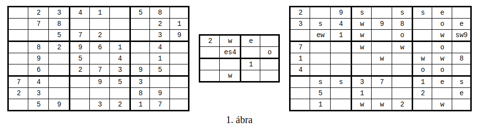
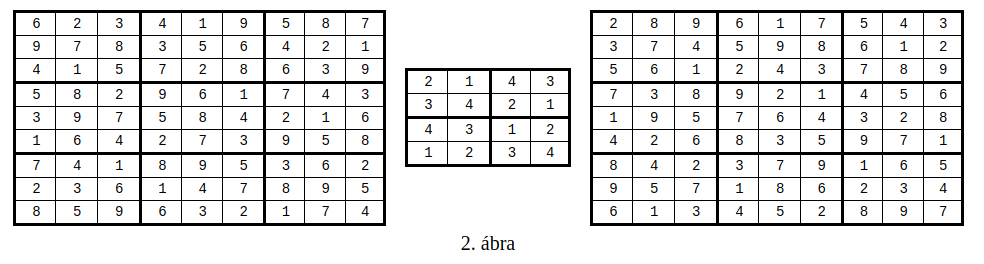

# Deklaratív programozás Erlang nagyházi - Sudoku-variáció: páratlan összegek

A megoldandó feladat a közismert Sudoku egy variánsa.

## Definíciók

**Sudoku-mátrixnak** hívunk egy olyan négyzetes mátrixot, amelyben a sorok (és az oszlopok) száma egy n = k<sup>2</sup> ≥ 1 négyzetszám. (Tehát a mátrix elemeinek száma n<sup>2</sup> = k<sup>4</sup>.)

Egy Sudoku-mátrixban **cellának** hívunk egy olyan (folytonos) részmátrixot, amely k sorból és k oszlopból áll, és bal felső sarkának sor- ill. oszlopsorszáma i*k+1 ill. j*k+1, ahol 0 ≤ i,j ≤ k-1 (a sorokat és oszlopokat 1-től számozzuk).

A Sudoku-mátrix elemeit **mezőknek** is nevezzük.

Egy **Sudoku-feladvány** egy olyan Sudoku-mátrix, amelynek egyes mezői segítő információkat (röviden infókat) tartalmaznak. A Sudoku játék közismert alapváltozatában csak ún. **száminfók** fordulnak elő, amelyek azt írják elő, hogy a megoldás adott mezője egy adott számot tartalmazzon.

Egy `n*n` méretű Sudoku-feladvány **helyes megoldása** egy olyan `n*n`-es Sudoku-mátrix, amelynek mezői 1 és n közé eső egész számok. A megoldás helyességének alapfeltétele, hogy annak minden sorában, oszlopában és cellájában különböző számok álljanak, tehát a mátrix minden ilyen részterülete az 1..n számok mindegyikét pontosan egyszer tartalmazza. Emellett a megoldás helyességéhez az is szükséges, hogy teljesítse az infók által előírt korlátozásokat. A feladvány egy (i,j) koordinátájú mezőjében levő M száminfó azt írja elő, hogy a megoldás azonos helyzetű, (i,j) koordinátájú mezője az M számot kell tartalmazza.

A jelen házi feladatban a száminfók mellett két további fajta segítő információ fordulhat elő. A **paritási** infó a megoldás adott mezőjének paritását adja meg, tehát előírja, hogy az páros vagy páratlan értékű legyen. A szomszédsági infó azt az információt hordozza, hogy az adott mezőben valamint egy megadott szomszédos mezőben levő értékek összege páratlan (vagyis paritásuk különbözik). A paritási és szomszédsági korlátozásokból egy mezőre több is vonatkozhat, ezek akár egymásnak vagy a száminfónak is ellentmondhatnak.

### Megjegyzések

  - Az újságokban vagy a világhálón publikált, "emberi fogyasztásra" szánt Sudoku-feladványok többnyire egyetlen megoldással bírnak. A jelen házi feladatban a megoldások számára nem teszünk semmilyen megszorítást, így a feladványoknak lehet 0, 1 vagy több megoldása is.
  - A szomszédsági infók halmaza általában nem teljes, azaz nem garantáljuk, hogy feladványban az összes teljesülő szomszédsági infó meg van adva. Azaz két szomszédos mező értékeinek összege akkor is lehet páratlan, ha nem vonatkozik rájuk szomszédsági infó. Másszóval, abból, hogy két mezőre nem vonatkozik szomszédsági infó, nem következik, hogy értékük összege páros.

## Példák

Példaként három Sudoku-feladványt mutatunk az 1. ábrán, ahol a k cellaméret rendre 3, 2, 3.

A legegyszerűbb esetben az infó egy szám: az adott mező előírt értéke. A további infókat egybetűs azonosítókkal jelezzük. A száminfótól különböző előírásokból többféle is lehet egy mezőben.

Három Sudoku-feladványt mutatunk az 1. ábrán, ahol rendre k = 3, 2, 3.



Az első feladványban csak száminfók vannak, mint a hagyományos Sudokuban. A második és harmadik feladványban betűk jelzik a paritási és szomszédsági infókat, ezek jelentése:

  - e (even): az adott mező értéke páros,
  - o (odd): az adott mező értéke páratlan,
  - s (south): az adott és az alatta levő mező értékének összege páratlan,
  - w (west): az adott és a tőle balra levő mező értékének összege páratlan.

Az e és o betűk **paritási infó**kat, míg az s és w betűk **szomszédsági infó**kat adnak meg.

A Sudoku-feladvány bal szélső oszlopának mezőiben nem állhat w, alsó sorának mezőiben pedig s, mivel ezek az infók nem létező mezőkre vonatkoznának.

Egy mezőben az ötféle infó (a száminfó ill. a négyféle, betűkkel jelzett infók) mindegyike legfeljebb egyszer szerepelhet. Megengedett, hogy ezek az infók ellentmondjanak egymásnak (pl. egy páratlan értéket jelző o infó mellett állhat egy páros szám száminfóként) – ilyen esetben természetesen a feladványnak nincs megoldása.

Az 1. ábrán látható három feladvány egy-egy megoldását a 2. ábra mutatja. Az első feladványnak van más megoldása is, a másik kettőnek az ábrán szereplő tábla az egyetlen megoldása.



## A megoldandó programozási feladat

Írjon sudoku néven olyan Erlang-függvényt, amely egy feladvány összes megoldását előállítja! Feltételezheti, hogy a feladvány cellamérete legfeljebb 10.

Az Erlang-függvény egyetlen paramétere a feladványt, az eredménye a megoldásokat írja le. Az eredménylistának a feladvány összes megoldását tartalmaznia kell, mégpedig minden megoldást pontosan egyszer (tetszőleges sorrendben). Ez azt is jelenti, hogy ha a feladványnak nincs megoldása, az eredmény az üres lista kell legyen.

Az Erlang-függvény paramétere egy {K,F} pár, ahol K és F jelentése azonos a Prolog-eljárás K és F struktúraelemeinek a jelentésével.

A feladványban minden mező infók listáját tartalmazza. Infó az e, o, s és w atom, továbbá az N szám (az adott mező előírt értéke). Az infók listájában ezek legfeljebb egyszer, de tetszőleges sorrendben fordulhatnak elő, és a lista üres is lehet.

Az Erlang-függvény eredménye a feladvány összes megoldásának listája, ahol mindegyik megoldást számokat tartalmazó listák listájaként ábrázolunk.

Például az 1. ábra középső feladványát a következő Erlang-párral írjuk le:

```erlang
{2, [[      [2],      [w],      [e],       []],
     [       [],  [e,s,4],       [],      [o]],
     [       [],       [],      [1],       []],
     [       [],      [w],       [],       []]]}
```

A feladvány egyetlen megoldását tartalmazó lista a következő:

```erlang
[[[ 2, 1, 4, 3],
  [ 3, 4, 2, 1],
  [ 4, 3, 1, 2],
  [ 1, 2, 3, 4]]]
```
A házi feladat megoldása során a feladványt megadó bemenő paraméterre vonatkozó formai előírások meglétét nem kell ellenőriznie, azaz feltételezheti, hogy a paraméter megfelel a fent ismertetett formai követelményeknek.

## A megírandó függvény, ill. eljárás specifikációja

A sudoku:sudoku/1 Erlang-függvény típusát a következő - megjegyzésként megadott - Erlang-típusdefiníciók írják le.

```erlang
%% @type sspec() = {size(), board()}.
%% @type size()  = integer().
%% @type field() = [info()].
%% @type info()  = e | o | s | w | integer().
%% @type board() = [[field()]].

%% @type ssol() = [[integer()]].

%% @spec sudoku:sudoku(SSpec::sspec()) -> SSols::[ssol()].
%% @doc  SSols az SSpec feladványt kielégítő megoldások listája.
```

A programot tartalmazó modul attribútumai ezek legyenek:
```erlang
-module(sudoku).
-author(email@unit.org.hu).
-vsn('year-mm-dd').
-export([sudoku/1]).
```

A házi feladat megoldása során a feladványra vonatkozó, fent ismertetett formai előírások meglétét nem kell ellenőriznie. Feltételezheti, hogy

  - a sudoku eljárás, ill. függvény első paraméterében a fenti típusdefinícióknak megfelelő feladvány-adatstruktúrát kap;
  - a megadott k cellamérettel összhangban a feladványban megadott mátrixnak k sora és k oszlopa van;
  - a száminfókban szereplő egész értékek az 1..k*k tartományba esnek.

## Keretprogramok

Programjait keretprogramok segítségével próbálhatja ki. A keretprogram bemenete egy olyan szövegfájl, amelynek első nem üres sora a Sudoku-feladvány cellaméretét, minden egyes további nem üres sora a Sudoku-feladvány egy-egy sorát tartalmazza, ahol az egyes mezők értékét egy vagy több szóköz választja el. A - karakter jelzi, ha egy mező nem tartalmaz infót. Ha tartalmaz, a mezőt az infók felsorolásával adjuk meg: a számot decimális alakban, a többi infót a betűjelével írjuk le; a jelek közé nem szabad szóközt tenni.

Például az 1. ábra közepső Sudoku-feladványát a 3. ábrán látható módon ábrázoljuk a bemeneti szövegfájlban:

```
3. ábra:

2
2   w   e   -
-   es4 -   o
-   -   1   -
-   w   -   -
```


A keretprogram kimenete a 4. ábrán bemutatotthoz hasonló tartalmú szövegfájl.

```
4. ábra:
-----

2  1  4  3
3  4  2  1
4  3  1  2
1  2  3  4

-----
```

### Az Erlang-keretprogram

A ksudoku.erl Erlang-keretprogram a következő függvényeket exportálja:

```erlang
@spec ksudoku:sudoku_be(FileIn::string()) -> SSpec::sspec()
```
SSpec a FileIn szövegfájlból beolvasott Sudoku-feladvány.

```erlang
@spec ksudoku:sudoku_ki(FileOut::string(), SSols::[ssol()]) -> void()
```
Az SSols listában átadott Sudoku-megoldásokat kiírja a FileOut szövegfájlba.

```erlang
@spec ksudoku:megold(FileIn::string(), FileOut::string()) -> void()
```
Beolvas egy feladványt a FileIn szövegfájlból és összes megoldását kiírja a FileOut szövegfájlba. Ehhez felhasználja a sudoku:sudoku/1 függvényt.

```erlang
@spec ksudoku:stopper(FileIn::string(), FileOut::string()) -> void()
```
Mint ksudoku:megold/2, de a végén kiírja a FileIn nevét, a megoldások számát és a futási időt is.

```erlang
@spec teljes_teszt(Timeout::integer()) -> [done|timeout].
```

A tests könyvtárban levő összes testXXXd.txt tesztállomány esetén:
lefuttatja a tesztet Timeout másodperces időkorláttal,
ellenőrzi, hogy a testXXXs.txt állományban megadott megoldáshalmazt kapta,
olvasható formában (lásd megold/2) kiírja az eredményt a tests_out könyvtár testXXXt.txt nevű állományába.

A fenti állománynevekben XXX egy tetszőleges hosszúságú számjegysorozatot jelöl.
Ezt a függvényt Eisenberger András egészítette ki a megoldás ellenőrzésével.


**Használat**: saját sudoku.erl nevű programját minden változtatás után fordítsa le, és **sudoku.beam** néven rakja a keretprogrammal azonos mappába, különben a ksudoku.erl keretprogram nem találja meg. Ezután indítsa el az Erlang interpretert, és töltse be a lefordított keretprogramot. Példa:

```erlang
Eshell V5.8  (abort with ^G)
1> l(ksudoku).
{module,ksudoku}
2> ksudoku:stopper("teszt0.txt","teszt0.sol").
```

A keretprogram automatikusan betölti a sudoku.beam programot, feltéve, hogy a keretprogrammal azonos mappában van.

Ha a saját `sudoku.erl` programját módosítja, a lefordítása után betöltheti az `l(sudoku)`. paranccsal, de újra betöltheti a `ksudoku.erl` keretprogramot is, ami magával húzza a módosított programot. Egyes esetekben célszerű újraindítani az Erlang értelmezőt.
